== 1)İçindekiler

. İçindekiler +
. Versiyon Geçmişi +
. Giriş +
. Canny Kenar Belirleme Algoritması +
.. Gaussian Filtresi +
.. Mean Filtresi +
.. Görüntünün Gradyan Operatörünün Bulunması +
... Sobel İşleci +
... Prewitt İşleci +
... Roberts İşleci +
. Kenar İnceltme +
.. Non Maxima Baskılama +
.. İkili Eşikleme +
.. Güçlü-Zayıf Kenar Ayırımı +
. Python ile Canny Kenar Belirleme Algoritmasının Uygulanması +
. Uygulama Görüntüleri +
.. Uygulama Öncesi +
.. Gauss Filtresi Sonrası +
.. Gradyan Büyüklüğü Hesaplandıktan Sonra +
.. Non-Maksima Baskılamadan Sonra +
.. İkili Eşiklemeden Sonra +
.. Güçlü Kenar ve Zayıf Kenar Ayrımından Sonra +
. Referanslar +

== 2) Versiyon Geçmişi

|===
|Tarih|Değişiklik|Kişi

|19.12.2016
|Canny Kenar Belirleme Algoritması

|Gönül Toktay
|9.12.2016
 
|Canny Kenar Belirleme Algoritması
|M.Sıla Genç

|19.01.2017

|Düzenleme
|Merve Tafralı

|===

== 3)Giriş +
Bu bölümde görüntü işlemede kullanılan bir diğer algoritmadan bahsedilecektir. Algoritmanın temel çalışma mantığı, tekniği ve örnek uygulaması anlatılacaktır. +

== 4)Canny Kenar Belirleme Algoritması +

Canny kenar belirleme algoritması; görüntüde keskin olarak belirlenmiş kenarları bulmak için John F. Canny tarafından geliştirilmiş ve aşamaları olan bir algoritmadır. Kenar bulmada son derece etkin olarak kullanılan bir algoritmadır. Aşamaları maddeleyecek olursa; 
. Görüntünün gürültülerini azaltmak amacıyla Gaussian çekirdekle konvolüsyon alınarak azaltılır. Gaussian filtre dışında Mean ya da Medyan filtrede kullanılabilir.
. Gradyan operatörü uygulanır. Bu şekilde görüntünün Gradyan büyüklüğü ve yönü hesaplanır. Bu işlem için Sobel filtresi en çok kullanılan yöntemdir. Bunun dışında Prewitt ve Robert kenar bulma metotları da mevcuttur.
. Kenarlar Non Maxima baskılama kullanılarak incelemeye alınır.
. İkili eşikleme uygulanır bu şekilde istenmeyen ayrıntılardan arındırılma işlemi gerçekleştirilir.
. Güçlü-zayıf ayrımı yapıldıktan sonra baskılama uygulanır ve asıl kenarlarla görüntüye son hali verilir.

=== 4.1)Gaussian Filtresi

Kenar bulma işlemi için görüntüde yumuşatma yapılmalıdır. Gaussian filtresi görüntüleri bulanıklaştırmak/yumuşatmak ve görüntü üzerindeki gürültüyü arındırmak için kullanılır. +
Gaussian fonksiyonu: +

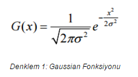 

Denklemde kullanılan σ değeri dağılımın standart sapmadır. Dağılımın ortalama 0 değere sahip olduğu varsayılmaktadır. +

image::2.png[GaussDağılımı] 

Gauss dağılımının grafiği Şekil 1’de gösterilmektedir. +

Gaussian fonksiyonu için önemli olabilecek bazı değerler tabloyla gösterilmiştir. +

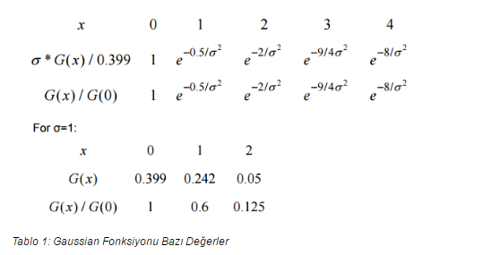

Gaussian fonksiyonu birçok araştırma alanında kullanılmaktadır. +
Gürültü veya bir veri için olasılık dağılımı tanımlar. +
Yumuşatma için kullanılan bir operatördür. +
Matematikte kullanılır. +

Gaussian görüntü işlemede çalışılırken 2 boyutlu Gaussian fonksiyonuna ihtiyaç duyulmaktadır.  +

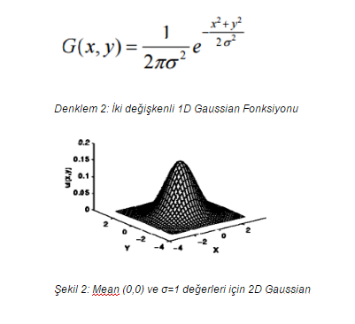

Gaussian filtresi 2D dağılımını nokta yayılımını kullanarak çalışır. Bu konvolüsyon ile sağlanır. Gaussian filtrenin görüntü üzerinde uygulaması basitçe şu şekilde gösterilebilir. Önemli ayrıntı işlem gerçekleştirilirken kenarlıklar üzerinde gerçekleştirilmez. +

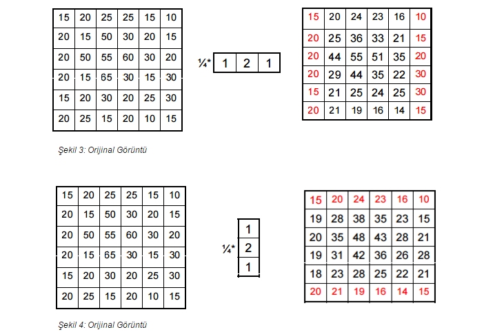

=== 4.2)Mean Filtresi
Mean filtresi alçak geçiren filtre olarak çalışmaktadır. Alçak geçiren filtre belirli bir frekansın üzerinde kalan sinyallerin işlenmesini sağlayan filtredir. Mean filtrenin çalışma mantığı; pencerede bulunan piksel değerinin diğer tüm piksel değerlerinin ortalaması ile değiştirerek çalışır. Pencere genellikle karedir yani matris olarak düşünülürse nxn boyutunda kare matristir.
Filtrenin çalışma mantığı bir örnekle gösterilecek olursa: +

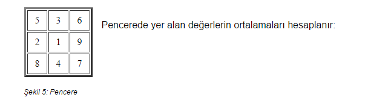

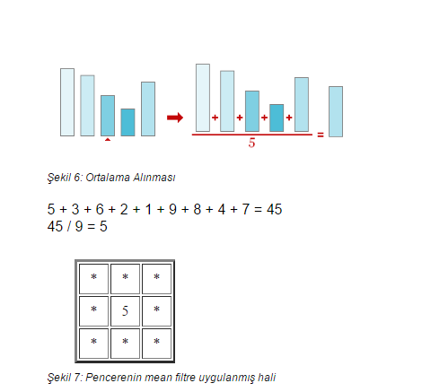

=== 2.3)Gradyan Operatörünün Bulunması
Kenarların belirlenmesinde 3 adet işleç kullanılmaktadır. Sobel işleci, Prewitt işleci ve Robert işleçleridir. 

==== 2.3.1) Sobel İşleci
Sayısal bir görüntü, bir fonksiyon olarak değerlendirildiğinde, bir nokta üzerindeki gradyan değerinin, 3×3 komşulukta mümkün olan dört merkezi yönde elde edilebilir gradyan değerlerinin vektör toplamları şeklinde oluşturulması düşüncesine dayanmaktadır. + 
Bu gradyan değerlerinin vektör toplamları; gradyan ölçümleri üzerinde ortalama değer bulunmasını sağlamaktadır. 3×3’lük komşuluk için merkez noktanın gradyan değeri, dik vektör çiftlerinin vektör toplamları olarak bulunmaktadır. +
Sobel işlecinde iki adet konvolüsyon çekirdeği yer alır. Bunlar görüntü içerisindeki ani ışık yoğunluk değişimi olan yerlerin belirlenmesini sağlar. +

==== 2.3.2) Prewitt İşleci
Sobel işleci gibi düşey ve yatay keskinlik sağlamaktadır. Sobel işlece göre daha basittir ama sonucunu değerlendirecek olursak biraz daha gürültü içermektedir. +

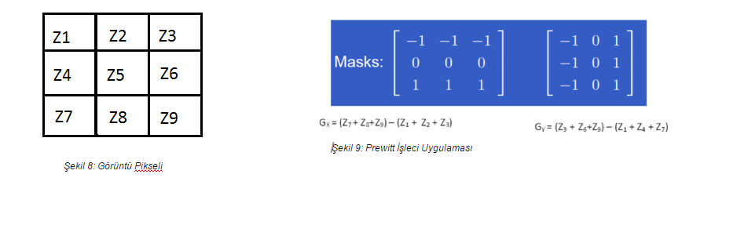 

==== 2.3.3) Robert İşleci
Görüntü işlemede kullanılan en eski işleçtir. Bu işleçle sadece yatay ya da sadece düşey olarak kenarlar elde edilmektedir. Hızlı ve basit bir uygulamaya sahip olduğundan gerçek zamanlı uygulamalarda çokça tercih edilmektedir. +

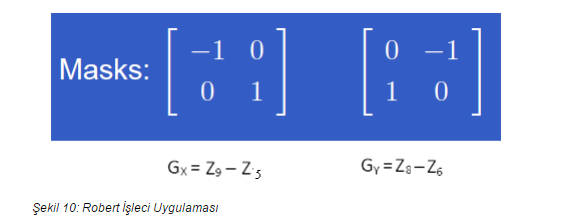 

Sırasıyla:Matematiksel hesaplanması gösterilirse, Konvolüsyon uygulandıktan sonra,2x2 boyutunda iki adet Gradyan operatörü elde edilmiştir

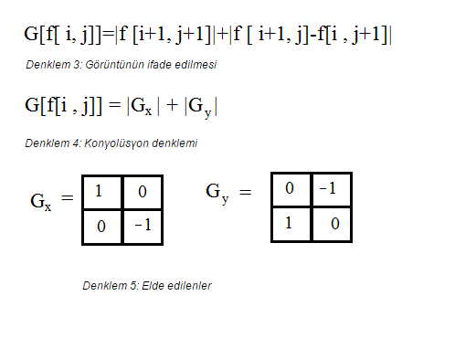

=== 2.4) Kenar İnceltme
İşleçler ile elde edilen görüntülerde kenarlar kalındır. Kenarların bir piksel gibi ince gösterilmesi için çeşitli metotlar geliştirilmiştir. Bu yöntemlerden en başarılısı maksimum olmayan piksel değerlerinin bastırılması yöntemidir. +
Çalışma mantığına bakılacak olursa; görüntü, görüntünün gradyanı yönünde taranır ve pikseller yerel maksimumun parçası değillerse sıfıra ayarlanır. +
Gradyan Operatörünün Büyüklüğü: 
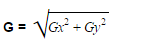
Gradyan Türevinin Yönü: θ = arctan(Gy /Gx)  ifade edilir. +
Gradyan Yönü: arctan(Gy /Gx) ile tayin edilmektedir.  +

Her bir piksel için gradyan yönü hesaplandıktan sonra, elde edilen açı değeri istikametindeki iki ilave komşu piksel seçilerek, ortanca pikselin bunlardan yüksek değerde olması istenir. Bu şart sağlanmaz ise, ortanca piksel sıfıra çekilerek kenar resminden elenir. Bu şekilde, kenar resminde sadece kenarlara dik yönde maksimum gradyan değerlerine sahip olan pikseller bırakılır. +
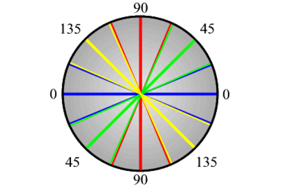 
Bulunan Gradyan operatörünün komşuluğunun incelenmesi için öncelikle, açı değerlerinin belirlenmesi gereklidir. Bunun için de kenar ayrımlarını saptayacağımız renk açılarını kullanmalıyız. Her renk değeri belirli aralıklar içerisinde kalır. Bunları şöyle bir formül ile hesaplayacağız. Sarı aralıktaki herhangi bir kenar yönü 0 derece olarak ayarlanır. Yeşil yönde düşen herhangi bir kenar yönü 45 dereceye ayarlanır. Mavi aralıktaki herhangi bir kenar yönü 90 dereceye ayarlanır. Son olarak, kırmızı yönde kalan herhangi bir kenar yönü 135 dereceye ayarlanır. +

=== 2.5) İkili Eşikleme ve Kenar Ayrımı

Gradyan genlik resminin belirli bir aralığa normalize edilmesi ve kenarların diki boyunca maksimum olmayanların bastırılması sonrasında elde edilen kenar resmi, piksel sürekliliği aşamasına girer. Kenar resmindeki piksel sürekliliğinin test edilmesi amacıyla yüksek ve düşük seviyede iki eşik değeri kullanılır. Süreklilik testi için şu adımlar uygulanır: +
Yüksek ve düşük seviye olmak üzere iki adet eşik seviyesi belirlenir. +
Her bir nokta için 
Eğer kenara dik maksimum gradyan genliği (piksel değeri) yüksek eşikten yüksek ise, kenar olarak bırakılır. +
Eğer kenara dik maksimum gradyan genliği düşük eşikten düşük ise, sıfıra çekilir. +
Eğer, piksel değeri, yüksek ve düşük eşik arasında ise, bu pikselin yüksek eşiği aşan bir komşusu var ise kenar olarak kalmasına izin verilir. +
Eğer ki eşiği aşan bir komşusu yok ise sıfıra çekilerek kenar resminden elenir. +

