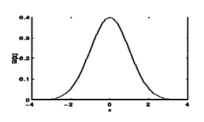

== 1)İçindekiler

. İçindekiler +
. Versiyon Geçmişi +
. Giriş +
. Canny Kenar Belirleme Algoritması +
.. Gaussian Filtresi +
.. Mean Filtresi +
.. Görüntünün Gradyan Operatörünün Bulunması +
... Sobel İşleci +
... Prewitt İşleci +
... Roberts İşleci +
. Kenar İnceltme +
.. Non Maxima Baskılama +
.. İkili Eşikleme +
.. Güçlü-Zayıf Kenar Ayırımı +
. Python ile Canny Kenar Belirleme Algoritmasının Uygulanması +
. Uygulama Görüntüleri +
.. Uygulama Öncesi +
.. Gauss Filtresi Sonrası +
.. Gradyan Büyüklüğü Hesaplandıktan Sonra +
.. Non-Maksima Baskılamadan Sonra +
.. İkili Eşiklemeden Sonra +
.. Güçlü Kenar ve Zayıf Kenar Ayrımından Sonra +
. Referanslar +

== 2) Versiyon Geçmişi

|===
|Tarih|Değişiklik|Kişi

|19.12.2016
|Canny Kenar Belirleme Algoritması

|Gönül Toktay
|9.12.2016
 
|Canny Kenar Belirleme Algoritması
|M.Sıla Genç

|19.01.2017

|Düzenleme
|Merve Tafralı

|===

== 3)Giriş +
Bu bölümde görüntü işlemede kullanılan bir diğer algoritmadan bahsedilecektir. Algoritmanın temel çalışma mantığı, tekniği ve örnek uygulaması anlatılacaktır. +

== 4)Canny Kenar Belirleme Algoritması +

Canny kenar belirleme algoritması; görüntüde keskin olarak belirlenmiş kenarları bulmak için John F. Canny tarafından geliştirilmiş ve aşamaları olan bir algoritmadır. Kenar bulmada son derece etkin olarak kullanılan bir algoritmadır. Aşamaları maddeleyecek olursa; 
. Görüntünün gürültülerini azaltmak amacıyla Gaussian çekirdekle konvolüsyon alınarak azaltılır. Gaussian filtre dışında Mean ya da Medyan filtrede kullanılabilir.
. Gradyan operatörü uygulanır. Bu şekilde görüntünün Gradyan büyüklüğü ve yönü hesaplanır. Bu işlem için Sobel filtresi en çok kullanılan yöntemdir. Bunun dışında Prewitt ve Robert kenar bulma metotları da mevcuttur.
. Kenarlar Non Maxima baskılama kullanılarak incelemeye alınır.
. İkili eşikleme uygulanır bu şekilde istenmeyen ayrıntılardan arındırılma işlemi gerçekleştirilir.
. Güçlü-zayıf ayrımı yapıldıktan sonra baskılama uygulanır ve asıl kenarlarla görüntüye son hali verilir.

=== 4.1)Gaussian Filtresi

Kenar bulma işlemi için görüntüde yumuşatma yapılmalıdır. Gaussian filtresi görüntüleri bulanıklaştırmak/yumuşatmak ve görüntü üzerindeki gürültüyü arındırmak için kullanılır http://www.omertaban.com/2013/05/14/goruntu-bozunmalari-ve-duzeltme-teknikleri/#more-1318[[6]]. +
Gaussian fonksiyonu: +

image::1.png[GaussianFonksiyonu] 

Denklemde kullanılan σ değeri dağılımın standart sapmadır. Dağılımın ortalama 0 değere sahip olduğu varsayılmaktadır. +

 

Gauss dağılımının grafiği Şekil 1’de gösterilmektedir. https://www.cs.auckland.ac.nz/courses/compsci373s1c/PatricesLectures/Gaussian%20Filtering_1up.pdf[[4]] +

Gaussian fonksiyonu için önemli olabilecek bazı değerler tabloyla gösterilmiştir. +

image::3.png[GFBazıDeğerler]

Gaussian fonksiyonu birçok araştırma alanında kullanılmaktadır. +
Gürültü veya bir veri için olasılık dağılımı tanımlar. +
Yumuşatma için kullanılan bir operatördür. +
Matematikte kullanılır. +

Gaussian görüntü işlemede çalışılırken 2 boyutlu Gaussian fonksiyonuna ihtiyaç duyulmaktadır.  +

image::4.png[görüntümatrisi]

Gaussian filtresi 2D dağılımını nokta yayılımını kullanarak çalışır. Bu konvolüsyon ile sağlanır. Gaussian filtrenin görüntü üzerinde uygulaması basitçe şu şekilde gösterilebilir. Önemli ayrıntı işlem gerçekleştirilirken kenarlıklar üzerinde gerçekleştirilmez. https://yavuzbugra.wordpress.com/2011/05/01/goruntu-islemede-filtreleme/[[1]] +

=== 4.2)Mean Filtresi
Mean filtresi alçak geçiren filtre olarak çalışmaktadır. Alçak geçiren filtre belirli bir frekansın üzerinde kalan sinyallerin işlenmesini sağlayan filtredir. Mean filtrenin çalışma mantığı; pencerede bulunan piksel değerinin diğer tüm piksel değerlerinin ortalaması ile değiştirerek çalışır. Pencere genellikle karedir yani matris olarak düşünülürse nxn boyutunda kare matristir.
Filtrenin çalışma mantığı bir örnekle gösterilecek olursa: +

image::6.png[Pencere]

http://www.librow.com/articles/article-5[[3]] +

image::7.png[ortalınması]

=== 4.3)Gradyan Operatörünün Bulunması
Kenarların belirlenmesinde 3 adet işleç kullanılmaktadır. Sobel işleci, Prewitt işleci ve Robert işleçleridir. 

==== 4.3.1) Sobel İşleci
Sayısal bir görüntü, bir fonksiyon olarak değerlendirildiğinde, bir nokta üzerindeki gradyan değerinin, 3×3 komşulukta mümkün olan dört merkezi yönde elde edilebilir gradyan değerlerinin vektör toplamları şeklinde oluşturulması düşüncesine dayanmaktadır. + 
Bu gradyan değerlerinin vektör toplamları; gradyan ölçümleri üzerinde ortalama değer bulunmasını sağlamaktadır. 3×3’lük komşuluk için merkez noktanın gradyan değeri, dik vektör çiftlerinin vektör toplamları olarak bulunmaktadır. +
Sobel işlecinde iki adet konvolüsyon çekirdeği yer alır. Bunlar görüntü içerisindeki ani ışık yoğunluk değişimi olan yerlerin belirlenmesini sağlar. +

==== 4.3.2) Prewitt İşleci
Sobel işleci gibi düşey ve yatay keskinlik sağlamaktadır. Sobel işlece göre daha basittir ama sonucunu değerlendirecek olursak biraz daha gürültü içermektedir. +

image::8.png[gpiksel] 

==== 4.3.3) Robert İşleci
Görüntü işlemede kullanılan en eski işleçtir. Bu işleçle sadece yatay ya da sadece düşey olarak kenarlar elde edilmektedir. Hızlı ve basit bir uygulamaya sahip olduğundan gerçek zamanlı uygulamalarda çokça tercih edilmektedir. +

image::11.png[robert] 

Sırasıyla:Matematiksel hesaplanması gösterilirse, Konvolüsyon uygulandıktan sonra,2x2 boyutunda iki adet Gradyan operatörü elde edilmiştir http://www.intelligence.tuc.gr/~petrakis/courses/computervision/filtering.pdf[[5]] +

http://www.cse.usf.edu/~r1k/MachineVisionBook/MachineVision.files/MachineVision_Chapter5.pdf[[11]] +

image::9.png[]

=== 4.4) Kenar İnceltme
İşleçler ile elde edilen görüntülerde kenarlar kalındır. Kenarların bir piksel gibi ince gösterilmesi için çeşitli metotlar geliştirilmiştir. Bu yöntemlerden en başarılısı maksimum olmayan piksel değerlerinin bastırılması yöntemidir. +
Çalışma mantığına bakılacak olursa; görüntü, görüntünün gradyanı yönünde taranır ve pikseller yerel maksimumun parçası değillerse sıfıra ayarlanır. +
Gradyan Operatörünün Büyüklüğü: +

Gradyan Türevinin Yönü: *θ = arctan(Gy /Gx)*  ifade edilir. +
Gradyan Yönü: *arctan(Gy /Gx)* ile tayin edilmektedir.  +

Her bir piksel için gradyan yönü hesaplandıktan sonra, elde edilen açı değeri istikametindeki iki ilave komşu piksel seçilerek, ortanca pikselin bunlardan yüksek değerde olması istenir. Bu şart sağlanmaz ise, ortanca piksel sıfıra çekilerek kenar resminden elenir. Bu şekilde, kenar resminde sadece kenarlara dik yönde maksimum gradyan değerlerine sahip olan pikseller bırakılır. +

Bulunan Gradyan operatörünün komşuluğunun incelenmesi için öncelikle, açı değerlerinin belirlenmesi gereklidir. Bunun için de kenar ayrımlarını saptayacağımız renk açılarını kullanmalıyız. Her renk değeri belirli aralıklar içerisinde kalır. Bunları şöyle bir formül ile hesaplayacağız. Sarı aralıktaki herhangi bir kenar yönü 0 derece olarak ayarlanır. Yeşil yönde düşen herhangi bir kenar yönü 45 dereceye ayarlanır. Mavi aralıktaki herhangi bir kenar yönü 90 dereceye ayarlanır. Son olarak, kırmızı yönde kalan herhangi bir kenar yönü 135 dereceye ayarlanır. +

=== 4.5) İkili Eşikleme ve Kenar Ayrımı

Gradyan genlik resminin belirli bir aralığa normalize edilmesi ve kenarların diki boyunca maksimum olmayanların bastırılması sonrasında elde edilen kenar resmi, piksel sürekliliği aşamasına girer. Kenar resmindeki piksel sürekliliğinin test edilmesi amacıyla yüksek ve düşük seviyede iki eşik değeri kullanılır. Süreklilik testi için şu adımlar uygulanır: +
Yüksek ve düşük seviye olmak üzere iki adet eşik seviyesi belirlenir. +
Her bir nokta için 
Eğer kenara dik maksimum gradyan genliği (piksel değeri) yüksek eşikten yüksek ise, kenar olarak bırakılır. +
Eğer kenara dik maksimum gradyan genliği düşük eşikten düşük ise, sıfıra çekilir. +
Eğer, piksel değeri, yüksek ve düşük eşik arasında ise, bu pikselin yüksek eşiği aşan bir komşusu var ise kenar olarak kalmasına izin verilir. +
Eğer ki eşiği aşan bir komşusu yok ise sıfıra çekilerek kenar resminden elenir. +

== 5) Python ile Canny Kenar Belirleme Algoritmasının Uygulanması

http://ahmetkakici.github.io/programlama/c-ile-goruntu-isleme-2//[[2]]

[source,python]
---------------------------------------------------------------------
from PIL import Image           
#PIL modülünden Image kütüphanesi eklenmiştir.
import math         
#Yapılacak matematik işlemleri için math kütüphanesi eklenmiştir.
import numpy        
#numpy kütüphanesi eklenmiştir.

image=Image.open("image.jpg")       

#image değişkeninin içerisine proje klasörümüzde bulunan 'image' adlı resim dosyasını atıyoruz.

newmat = image.load()           

#newmat adlı yeni bir matris oluşturup bunun içerisine resim dosyamızı yüklüyoruz.

wdh=image.size[0]           

#wgh değişkenine resim dosyasının genişlik boyutunu atıyoruz. Dosyamızın genişliği 640 piksel.

hgh=image.size[1]           

#hgh değişkenine resim dosyasının yükseklik boyutunu atıyoruz. Dosyamızın yüksekliği 360 piksel

graylist=[[0]*hgh for x in range(wdh)]  

#graylist adında tanımladığımız matrisin boyutunu yukarıda aldığımız resim dosyamızın genişlik ve yükseklik değerlerine göre belirliyoruz.

for k in range(wdh):        

#Resim dosyamızı gri tonlarına çevirmek için iç içe döngü ile matrise çekiyoruz. Böylece her bir piksel birer matris elemanı olacaktır. 

    for l in range(hgh):
        r, g, b = image.getpixel((k, l))        
        
        #Her pikselde birer r(kırmızı),g(yeşil),b(mavi) değeri bulunmaktadır. Bunlar o piksele renk veren kodlardır. Öncelikle 'getpixel' fonksiyonu ile bu değerleri r,g,b değişkenlerine atıyoruz. 
        
        gray=(int)((r*0.2126)+(g*0.7152)+(b*0.0722))        
        #Resimizi gri yapacak olan sayısal değeri elde etmek için, insan gözünün gama ışınlarını algılama oranlarına göre oluşturulan formül ile aldığımız katsayıları r,g,b değişkenleriyle çarpıp topluyoruz. Böylece resimdeki her piksel için ayrı bir gri renk tonu elde etmiş oluyoruz.
        graylist[k][l]=gray         
        
        #graylist matrisinin her elemanına ağırlık toplama yöntemi ile bulduğumuz gri değerini kaydediyoruz.
        
        newmat[k,l]=(gray,gray,gray)            
        #Resim dosyasını yüklediğimiz matrisin tüm elemanlarına(piksellerine) ağırlık toplama yöntemine göre bulduğumuz gri renk kodunu atıyoruz. Böylece resmin her pikseli renk tonuna göre gri rengini almış olacaktır.Burada kırmızı, yeşil, mavi renk tonlarının hepsine aynı değeri atıyoruz. Bu yöntem gri rengini elde etmemizi sağlıyor.

image.save("gray.bmp")       

#Artık gri tonlarında olan resmi proje dosyasının içine .bmp uzantılı olarak kaydediyoruz.

grayimage = Image.open("gray.bmp")  

#Kaydettiğimiz resim dosyasını tekrar açıyoruz.

mean_im = grayimage.load()     

#Açtığımız resim dosyasını mean_im adlı değişkene yüklüyoruz.

meanArray=[[0]*hgh for x in range(wdh)]     

#Resim dosyasının boyutu kadar bir boş matris oluşturuyoruz. Bu matris ile Mean filtresini resme uygulayaccağız.

for i in range (1,hgh-1):       

#Matris elemanlarına erişmek için iç içe döngüler kullanıyoruz.
    for j in range (1,wdh-1):       
    
    #Mean filtresi resmin her pikseli yani oluşturduğumuz matrisin her elemanına gri olan resmin sırasıyla tüm piksellerini toplayıp bölerek orta bir değer atar.
        meanArray[j][ i] = (graylist[j][i - 1]
            + graylist[j][i + 1]
            + graylist[j][i]
            + graylist[j - 1][ i - 1]
            + graylist[j - 1][i + 1]
            + graylist[j - 1][ i]
            + graylist[j + 1][i - 1]
            + graylist[j + 1][i + 1]
            + graylist[j + 1][ i] ) / 9;
        mean_value=(int)(round(meanArray[j][i]))   
        
        #Bulunan değer yuvarlanır ve yüklenen resme işlenir.
        
        mean_im[j,i] = (mean_value,mean_value,mean_value)
grayimage.save("mean.bmp")      

#Mean filtresinden geçen resim proje dosyasına kaydedilir.

meanimage=Image.open("mean.bmp")       

#Kaydettiğimiz resmi tekrar açıp bir matrise yüklüyoruz.

robert_im=meanimage.load()
robertArray=[[0]*hgh for x in range(wdh)]
robert_x=[[2,1,0],          

#Kenar bulma işleçlerinden olan Robert işleci ile kenarları diagonal olarak taramak için iki matris oluşturuyoruz.

         [1,0,-1],
         [0,-1,-2]]
robert_y=[[0,-1,-2],
         [1,0,-1],
         [2,1,0]]
for m in range (1,hgh-1):           

#İç içe döngüler ile matrisin her elemanına raporda belirtilen Robert kenar bulma formülünü uyguluyoruz.

    for n in range (1,wdh-1):
        robertArray[n][m]=(int)(math.fabs(graylist[n][m] - graylist[n - 1][m - 1])) + (int)(math.fabs(graylist[n][m - 1] - graylist[n - 1][m]))
        rbrt_value=int(round(robertArray[n][m]))       
        #Bulunan değer yuvarlanır ve bir değişkene atılır.
        
        robert_im[n,m] = (rbrt_value,rbrt_value,rbrt_value)     
        
        #Son olarak bulunan değer resim matrisine işlenir.
        
meanimage.save("robert.bmp")            

#Robert kenar bulma işleminden geçen resim proje dosyasına kaydedilir.

robertimage=Image.open("robert.bmp")        

#Kaydettiğimiz resim doyasını non maxima işleminden geçirmek için açıyoruz. Bu işlem ile kenarlar arasında baskılama yapacağız.

image_non=robertimage.load()
newangle=[[0]*hgh for x in range(wdh)]     

#Kenar ve açı işlemlerimiz için iki adet resim boyutunda matris oluşturulmuştur.

newedge=[[0]*hgh for x in range(wdh)]       
for x in range (1,wdh-1,1):        

#Raporda belirtilen Gx ve Gy değerleri için konvolüsyon işlemi yapılmaktadır. Bu işlem ile görüntünün her piksel değeri oluşturduğumuz Robert işleç matrisi ile çarpılıp toplanacaktır. Böylece Gx ve Gy değerini elde ediyoruz.

    for y in range (1,hgh-1,1):
        Gx = (robert_x[0][0] * graylist[x-1][y-1] 
            + robert_x[0][1] * graylist[x-1][y] 
            + robert_x[0][2] * graylist[x-1][y+1] 
            + robert_x[1][0] * graylist[x][y-1] 
            + robert_x[1][1] * graylist[x][y] 
            + robert_x[1][2] * graylist[x][y+1] 
            + robert_x[2][0] * graylist[x+1][y-1] 
            + robert_x[2][1] * graylist[x+1][y] 
            + robert_x[2][2] * graylist[x+1][y+1])
        
        Gy = (robert_y[0][0] * graylist[x-1][y-1]
            + robert_y[0][1] * graylist[x-1][y] 
            + robert_y[0][2] * graylist[x-1][y+1]
            + robert_y[1][0] * graylist[x][y-1]
            + robert_y[1][1] * graylist[x][y]
            + robert_y[1][2] * graylist[x][y+1]
            + robert_y[2][0] * graylist[x+1][y-1]
            + robert_y[2][1] * graylist[x+1][y]
            + robert_y[2][2] * graylist[x+1][y+1])
        
        edge=round(math.sqrt((Gx*Gx)+(Gy*Gy)))      
        
        #Elde edilen Gx ve Gy değeri kullanılarak kenar formülünü uyguluyoruz.
        
        thisAngle=math.degrees(math.atan2(Gx, Gy))      
        
        #Non maxima işlemi için kullanılan renk açıları bulunmaktadır. 0,45,90,135 açı değerlerini renk tablosunda belirtildiği üzere açı aralığını kontrol ederek açı listesinin değerlerini buluyoruz.
        
                      
        if ( ( (thisAngle < 22.5) and (thisAngle > -22.5) ) or (thisAngle > 157.5) or (thisAngle < -157.5) ):
                newangle[x][y] = 0
        if ( ( (thisAngle > 22.5) and (thisAngle < 67.5) ) or ( (thisAngle < -112.5) or (thisAngle > -157.5) ) ):
                newangle[x][y] = 45
        if ( ( (thisAngle > 67.5) and (thisAngle < 112.5) ) or ( (thisAngle < -67.5) or (thisAngle > -112.5) ) ):
                newangle[x][y] = 90
        if ( ( (thisAngle > 112.5) and (thisAngle < 157.5) ) or ( (thisAngle < -22.5) and (thisAngle > -67.5) ) ):
                newangle[x][y] = 135
        edge=int(edge)
        newedge[x][y]=edge      
        
        #Sonuç olarak bulunan tüm değerleri integer dönüşümüne tabi tutarak edgelist matrisine topluyoruz.
        
        
for p in range(1,wdh-1,1):      

#Non Maxima işlemi için gereken komşuluklar kontrol edilir. 

    for q in range(1,hgh-1,1):     
        if newangle[p][q]==0:
            if(newedge[p][q] <= newedge[p+1][q]) or (newedge[p][q] <= newedge[p-1][q]):
                newedge[p][q] = 0
        elif newangle[p][q] == 45:
            if(newedge[p][q] <= newedge[p+1][q+1]) or (newedge[p][q] <= newedge[p-1][q-1]):
                newedge[p][q] = 0
        elif newangle[p][q] == 90:
            if(newedge[p][q] <= newedge[p][q+1]) or (newedge[p][q] <= newedge[p][q-1]):
                newedge[p][q] = 0
        else :
            if(newedge[p][q]<=newedge[p-1][q+1]) or (newedge[p][q] <= newedge[p+1][q-1]):
                newedge[p][q] = 0
        nonmax_value=newedge[p][q]     
        
        #Komşuluk değerine göre elde edilen siyah noktalar matris elemanı olarak tutulur.
        
        image_non[p,q] = (nonmax_value,nonmax_value,nonmax_value)
robertimage.save("nonmax.bmp")      

#Non maxima işleminden geçen resim dosyası proje klasörüne kaydedilir.

maxim=numpy.max(newedge)       

#numpy kütüphanesi kullanılarak non maxima işleminde elde edilen değerlerden en yüksek değer seçilir.

thrd_hgh=maxim*0.1         

#Seçilen değere göre iki ayrı threshold değeri hesaplanır ve değerlere göre resim dosyasına ikili eşikleme yapılır.

thrd_low=maxim*0.5
high_thres=int(round(thrd_hgh))
low_thres=int(round(thrd_low))
for a in range(1,wdh-1,1):          

#Her eleman için kontrol yapılır.

    for b in range (1,hgh-1,1):
        if newedge[a][b] > high_thres:      
        
        #Eşik değerinden yüksek olanlar aynen bırakılır.
        
            newedge[a][b] = newedge[a][b]
        elif (newedge[a][b] > low_thres) and (newedge[a][b] < high_thres):     
        
        #İki eşik değerinin arasında olanlar tam bir değere yuvarlanır.
        
            newedge[a][b] = int(round(newedge[a][b]*0.1))
        else:
            newedge[a][b]=0
        thrd_value=newedge[a][b]
        image_non[a,b]=(thrd_value,thrd_value,thrd_value)
robertimage.save("thrd.bmp")           

#Son olarak resim dosyası proje klasörüne kaydedilir.
---------------------------------------------------------------------

== 6) Uygulama Görüntüleri

=== 6.1) Uygulama Öncesi

=== 6.2) Mean Filtresi Sonrası

=== 6.3) Gradyan Büyüklüğü Hesaplandıktan Sonra

=== 6.4) Non-Maksima Baskılamadan Sonra

=== 6.5) İkili Eşikleme ve Kenar Ayrımından Sonra

== 7) REFERANSLAR
. https://yavuzbugra.wordpress.com/2011/05/01/goruntu-islemede-filtreleme/
. http://ahmetkakici.github.io/programlama/c-ile-goruntu-isleme-2//
. http://www.librow.com/articles/article-5
. https://www.cs.auckland.ac.nz/courses/compsci373s1c/PatricesLectures/Gaussian%20Filtering_1up.pdf
. http://www.intelligence.tuc.gr/~petrakis/courses/computervision/filtering.pdf
. http://www.omertaban.com/2013/05/14/goruntu-bozunmalari-ve-duzeltme-teknikleri/#more-1318
. http://www.yildiz.edu.tr/~bayram/sgi/saygi.htm 
. http://fenbildergi.aku.edu.tr/pdf/0801/8-1(217-230).pdf
. http://stackoverflow.com/questions/17815687/image-processing-implementing-sobel-filter
. http://web.firat.edu.tr/iaydin/bmu357/bmu_357_bolum7.pdf
. http://www.cse.usf.edu/~r1k/MachineVisionBook/MachineVision.files/MachineVision_Chapter5.pdf
. http://www.emo.org.tr/ekler/14205c3cba312d9_ek.pdf

